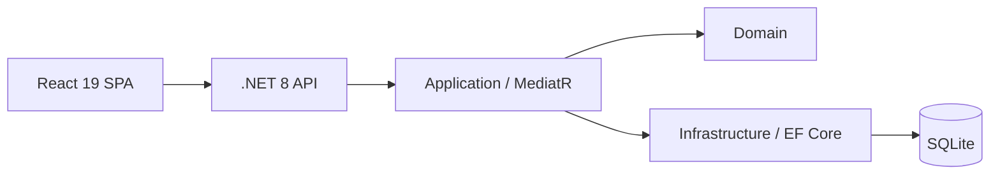

# OEC-IMS Architecture Overview

Short reference — full detail in [phase-1-architecture-blueprint.md](phase-1-architecture-blueprint.md).

## System shape

**Modular monolith:** React SPA + .NET 8 Web API + EF Core (SQLite → SQL Server).

## Layers

| Project | Role |
|---------|------|
| `OEC.IMS.Api` | HTTP, auth, Swagger, middleware |
| `OEC.IMS.Application` | Commands, queries, validators, mappings |
| `OEC.IMS.Domain` | Entities, enums, domain exceptions |
| `OEC.IMS.Infrastructure` | EF Core, persistence |

## V1 features

Dashboard · Parts · Vehicle compatibility · Orders · Mock auth

## ADRs

| ADR | Topic |
|-----|-------|
| [001](adr/001-hybrid-clean-vertical-slice.md) | Hybrid Clean + vertical slice |
| [002](adr/002-sqlite-with-sql-server-path.md) | SQLite / SQL Server |
| [003](adr/003-mock-jwt-authentication.md) | Mock JWT auth |

## Cursor skills

Project skills in `.cursor/skills/oec-ims-*` — invoke by name when implementing features.
