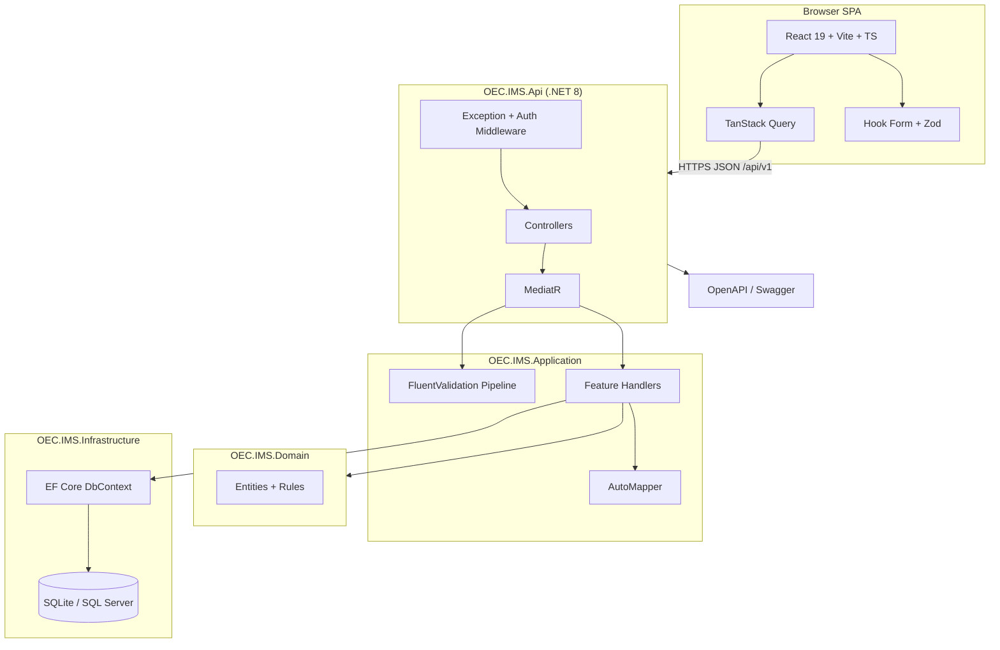
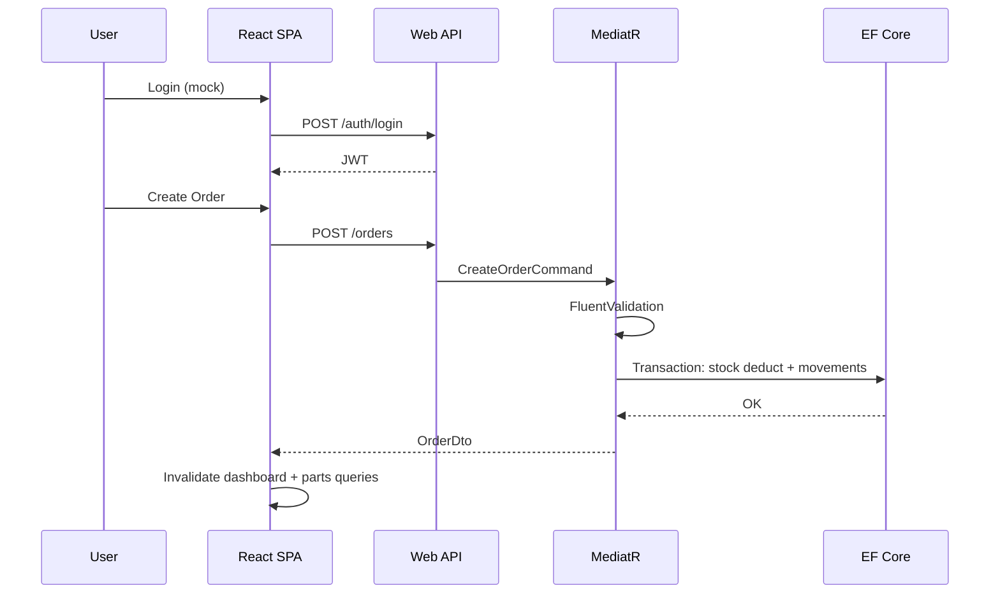

# OEC Inventory Management System — Phase 1 Architecture Blueprint

> **Status:** Architecture & skills definition only — no implementation yet.  
> **Purpose:** Interview-ready enterprise design reference for Cursor implementation, GitHub portfolio, and demo deployment.

---

## Table of Contents

1. [Executive Architecture Summary](#1-executive-architecture-summary)
2. [Recommended V1 Scope](#2-recommended-v1-scope)
3. [Skill Coverage Matrix](#3-skill-coverage-matrix)
4. [Frontend Architecture Recommendation](#4-frontend-architecture-recommendation)
5. [Backend Architecture Recommendation](#5-backend-architecture-recommendation)
6. [Database Architecture Recommendation](#6-database-architecture-recommendation)
7. [Repository Structure](#7-repository-structure)
8. [Enterprise Standards](#8-enterprise-standards)
9. [GitHub Readiness Plan](#9-github-readiness-plan)
10. [Risks & Overengineering Warnings](#10-risks--overengineering-warnings)
11. [Final Recommended Architecture](#11-final-recommended-architecture)

---

## 1. Executive Architecture Summary

**OEC Inventory Management System (OEC-IMS)** is a **modular monolith**: a **.NET 8 Web API** using **Clean Architecture layering** with **vertical-slice feature organization** in the application layer, plus a **React 19 + Vite SPA** using **TanStack Query** for server state.

### Core Architectural Stance

| Decision | Choice |
|----------|--------|
| Deployment unit | Single API + single SPA (modular monolith) |
| Application pattern | CQRS-lite via **MediatR** (commands/queries per use case) |
| Persistence | **EF Core** + **SQLite** (dev/portfolio), **SQL Server–ready** via provider abstraction |
| API contract | **OpenAPI** first; versioned URL path (`/api/v1/...`) |
| Auth | **Mock JWT/session** for demo only; interfaces ready for real IdP later |

### Why This Shape

| Lens | Rationale |
|------|-----------|
| **Business value** | Covers dealer workflows (parts, stock, compatibility, orders) without multi-tenant/warehouse/supplier complexity. |
| **Interview value** | Demonstrates layering, SOLID, validation pipelines, mapping, CQRS, EF relationships, transactions, and modern React data patterns—not tutorial CRUD. |
| **Industry standard** | Modular monolith is the default greenfield enterprise choice before microservices; Clean + vertical slices aligns with modern .NET solution templates. |

### Explicit Non-Goals (V1)

- Real identity provider (Azure AD, Auth0)
- Event sourcing / CQRS with separate read DB
- Microservices, message buses, Redis caching
- Multi-warehouse, suppliers, purchase orders
- File storage / barcodes / real-time (SignalR)

---

## 2. Recommended V1 Scope

### In V1 (MVP — Interview-Ready, Demo-Stable)

| Module | V1 Capabilities | Rationale |
|--------|-----------------|-----------|
| **Authentication** | Mock login (fixed users/roles), protected routes, role claims on token | Auth middleware/filters without IdP scope creep |
| **Dashboard** | KPI cards: total parts, low-stock count, pending orders, last 10 stock movements | Aggregations, read queries, React Query caching |
| **Parts Inventory** | CRUD, search (SKU/name), filters (category, low stock), pagination, stock on-hand, adjust stock | Core domain; richest FluentValidation + MediatR + EF demo |
| **Vehicle Compatibility** | Manufacturer/model/year lookup; link/unlink parts; “parts for vehicle” search | Many-to-many EF; join queries; filtered search |
| **Orders** | Create order (line items), stock deduction in transaction, list/detail, cancel (if not fulfilled) | Transactions, concurrency, business rules |

### Postpone (V2+)

| Item | Why Postpone |
|------|----------------|
| Category tree / admin CRUD for lookups | CRUD noise; seed reference data in V1 |
| Purchase orders / suppliers | Different bounded context |
| Multi-location inventory | Schema + UX complexity |
| Barcode scanning, images, attachments | Extra infrastructure |
| Audit log UI | DB audit columns only; no viewer |
| Email / notifications | Out of stack focus |
| API v2 endpoints | Design for versioning; ship v1 only |
| Advanced reporting / exports | Not required for stack demo |
| Real OAuth/OIDC | Mock auth is explicit V1 scope |

### V1 Success Criteria

- Local run in **under 10 minutes** (README-driven).
- Every required package has at least one **intentional, explainable** use case in code review.
- One demo path: **login → search part → check vehicle fit → create order → dashboard updates**.

---

## 3. Skill Coverage Matrix

| Technology | Where It Lives | Intentional V1 Demonstration |
|------------|----------------|------------------------------|
| **MediatR** | Application layer | One handler per use case; pipeline behaviors (logging, validation) |
| **FluentValidation** | Application validators | Part rules; order qty vs stock; vehicle year range; async uniqueness (SKU) |
| **AutoMapper** | Application profiles | Entity ↔ DTO; `ProjectTo` on list queries; nested order lines |
| **OpenAPI** | API + Swashbuckle | XML comments, schemas, ProblemDetails, JWT security scheme (mock) |
| **EF Core** | Infrastructure | Configurations, migrations, includes, transactions, indexes, soft-delete filter |
| **React 19** | Frontend | Modern hooks; actions where useful; concurrent-friendly lists |
| **Vite** | Frontend tooling | Fast dev, env-based API URL, static build for hosting |
| **TanStack Query** | Frontend data | Queries/mutations, invalidation, optional optimistic stock adjust |
| **Tailwind CSS v4** | Frontend styling | Design tokens, responsive layout, light/dark via CSS variables |
| **TypeScript** | Frontend | Strict mode; API types from OpenAPI codegen |

### Supporting Frontend Libraries (Recommended)

| Library | Include V1? | Why | Interview Value |
|---------|-------------|-----|-----------------|
| **React Router v7** | Yes | SPA routes, protected layouts | Standard enterprise SPA |
| **React Hook Form** | Yes | Part/order forms | Performance + field-level errors |
| **Zod** | Yes | Client schema validation | Mirrors server rules; pairs with Hook Form |
| **TanStack Table** | Yes | Parts/orders grids | Server pagination/sort without reinventing tables |
| **Zustand** | **No** | React Query + Context + URL params sufficient | Avoids redundant global server-state cache |

---

## 4. Frontend Architecture Recommendation

### UI Architecture Pattern

**Feature-Sliced Design (lite):** `app` → `features` → `shared` → `entities`

| Lens | Rationale |
|------|-----------|
| **Why** | Scales with modules; recruiters navigate by feature folder. |
| **Business value** | Teams can own Dashboard vs Orders independently later. |
| **Interview value** | Clear smart (features) vs dumb (shared UI) separation. |

### Folder Structure

```text
frontend/
├── src/
│   ├── app/                    # Router, providers, global layout
│   │   ├── providers/          # QueryClient, AuthProvider, ThemeProvider
│   │   ├── routes/             # Route config, lazy-loaded feature routes
│   │   └── layout/             # AppShell, Sidebar, Header
│   ├── features/
│   │   ├── auth/
│   │   ├── dashboard/
│   │   ├── parts/
│   │   ├── vehicles/
│   │   └── orders/
│   ├── entities/               # Domain types, mappers (if not codegen-only)
│   ├── shared/
│   │   ├── api/                # fetch client, interceptors, error normalizer
│   │   ├── ui/                 # Button, Input, Modal, DataTable, Badge...
│   │   ├── hooks/
│   │   └── lib/                # formatters, constants
│   └── main.tsx
├── public/
└── vite.config.ts
```

Each **feature** contains: `api/` (query keys + hooks), `components/`, `pages/`, `schemas/` (Zod), `types/`.

### State Management

| State Type | Approach |
|------------|----------|
| Server data | **TanStack Query** exclusively |
| Auth session | React Context + `sessionStorage` |
| UI ephemeral | `useState` / URL search params (filters) |
| Theme | CSS variables + `localStorage` preference |

**Do not** duplicate server cache in Zustand/Redux for V1.

### Component Strategy

- **Shared UI:** Presentational, variant-driven (Tailwind; optional `cva`).
- **Feature components:** Compose shared UI + wire Query hooks.
- **Pages:** Route entry; minimal logic.

### Reusable Components (V1 Minimum)

`AppShell`, `PageHeader`, `DataTable`, `SearchInput`, `FilterBar`, `FormField`, `Modal`, `ConfirmDialog`, `EmptyState`, `ErrorState`, `LoadingSkeleton`, `StatusBadge`, `StockIndicator`.

### API Communication

- Base `fetch` wrapper with auth header injection.
- **OpenAPI codegen** → `src/shared/api/generated`.
- Per-feature React Query hooks: `useParts`, `useCreateOrder`, etc.
- Map API **ProblemDetails** → toast + inline field errors (`setError`).

### Forms & Validation

- **React Hook Form + Zod resolver** on Part and Order forms.
- Server 400 validation merged into RHF via `setError`.
- Client = UX; server (FluentValidation) = authority.

### Loading & Error Patterns

| Pattern | Usage |
|---------|--------|
| Route `Suspense` + skeleton | Initial page load |
| Query `isPending` / `isFetching` | Tables, refetch |
| Mutation `isPending` + disabled submit | Forms |
| `ErrorBoundary` per feature route | Unexpected render errors |
| `QueryErrorResetBoundary` | Retry after failed query |

### Table / Grid Strategy

- **TanStack Table** + shared `DataTable` wrapper.
- Server-side pagination/sort/filter aligned with backend `PagedRequest`.
- Sticky header; card fallback on small screens.

### UI/UX Direction

| Element | Direction |
|---------|-----------|
| **Design language** | Enterprise automotive B2B; neutral slate base |
| **Accent** | Deep blue `#1e3a5f`, action blue `#2563eb` (OEConnection-inspired) |
| **Stock semantics** | Green / amber / red for in-stock / low / out |
| **Theme** | Tailwind v4 `@theme` CSS variables; light/dark; system default |
| **UX** | Clear hierarchy, empty states with next action, confirm on delete/cancel order |

---

## 5. Backend Architecture Recommendation

### Clean Architecture vs Vertical Slice

**Recommendation: Hybrid**

```text
┌─────────────────────────────────────────┐
│  API (Presentation)                     │  Thin controllers → MediatR only
├─────────────────────────────────────────┤
│  Application (Vertical Slices)          │  Features/{Parts,Orders,...}/
│    Commands / Queries / Validators      │
│    Handlers / DTOs / Mapping Profiles     │
├─────────────────────────────────────────┤
│  Domain                                 │  Entities, enums, domain exceptions
├─────────────────────────────────────────┤
│  Infrastructure                         │  EF Core, persistence
└─────────────────────────────────────────┘
```

| Lens | Rationale |
|------|-----------|
| **Why hybrid** | Clean rings satisfy enterprise layering interviews; vertical slices avoid anemic god-service classes. |
| **Avoid** | Pure Clean with 47 interfaces for a 5-table app (over-engineered). |

### CQRS Strategy

- **Commands:** CreatePart, UpdatePart, AdjustStock, CreateOrder, CancelOrder, LinkPartToVehicle, etc.
- **Queries:** GetPartById, SearchParts, GetDashboardMetrics, GetOrders, GetCompatibleParts, etc.
- **No** separate read database; **no** event sourcing.
- Queries use `AsNoTracking()` + projections in handlers (pragmatic CQRS).

### Solution / Feature Structure

```text
backend/
├── src/
│   ├── OEC.IMS.Api/
│   ├── OEC.IMS.Application/
│   │   └── Features/
│   │       ├── Parts/
│   │       ├── Orders/
│   │       ├── Vehicles/
│   │       ├── Dashboard/
│   │       └── Auth/
│   ├── OEC.IMS.Domain/
│   └── OEC.IMS.Infrastructure/
└── tests/
    ├── OEC.IMS.Application.UnitTests/
    └── OEC.IMS.Api.IntegrationTests/
```

Per feature: `Commands/`, `Queries/`, `Validators/`, `Handlers/`, `Dtos/`, `Mappings/`.

### Package Demonstration Map

#### MediatR

- All endpoints: `IMediator.Send(command/query)`.
- Pipeline behaviors: `ValidationBehavior`, `LoggingBehavior` (optional: `PerformanceBehavior`).
- **Talking point:** Cross-cutting concerns without controller attribute soup.

#### FluentValidation

- `AbstractValidator<T>` per command.
- Async rules: SKU uniqueness.
- Order: qty ≤ available; at least one line.
- Wired via MediatR pipeline—not manual in controllers.

#### AutoMapper

- Profiles per feature: `PartProfile`, `OrderProfile`.
- `ProjectTo<PartListItemDto>()` on `IQueryable` for search.
- **Avoid:** mapping in controllers; over-mapping trivial 3-field DTOs.

#### OpenAPI

- Swashbuckle: annotations, mock JWT scheme, examples.
- CI artifact: `openapi.json` for frontend codegen.
- XML docs on controllers/DTOs.

#### EF Core

- Fluent configurations; global soft-delete filter.
- Explicit transaction in `CreateOrderHandler`.
- Seed: manufacturers, models, categories, demo parts.

### DTO Strategy

- **Request:** Commands carry data (`CreatePartCommand`).
- **Response:** Query DTOs only—never expose entities.
- **Paging:** `PagedResult<T>` → `Items`, `Page`, `PageSize`, `TotalCount`, `TotalPages`.
- **Success:** HTTP semantics (no generic `ApiResponse<T>` wrapper).
- **Errors:** RFC 7807 **ProblemDetails**.

### Validation Layers

| Layer | Responsibility |
|-------|----------------|
| FluentValidation | Business rules, cross-field, DB checks |
| Data annotations | Minimal on DTOs for OpenAPI if needed |
| Domain | Invariants (e.g., cannot go negative on stock) |

### Exception Handling

- `ExceptionHandlingMiddleware` → ProblemDetails.
- Domain exceptions → 400 / 404 / 409.
- No per-controller try/catch.

### Logging

- **Serilog** (structured), request logging, CorrelationId.
- MediatR behavior logs command name + duration.

### Health Checks

- `/health` → DB connectivity (`AddDbContextCheck`).

### API Versioning

- URL: `/api/v1/...`
- Single implementation in V1; document version in OpenAPI.

### Pagination

- Query: `page`, `pageSize`, `sort`, `sortDirection`, feature filters.
- Cap `pageSize` at **100** server-side.

### Dependency Injection

- **Api:** MediatR, validators, AutoMapper, auth, Swagger.
- **Infrastructure:** DbContext; `IUnitOfWork` only if it clarifies order transaction story.
- **Convention:** `services.AddApplication()`, `services.AddInfrastructure()`.

### Mock Authentication

- `POST /api/v1/auth/login` → JWT (dev secret).
- Users: e.g. `admin`, `inventory_clerk` with roles.
- `[Authorize(Roles = "Admin")]` on sensitive ops (optional demo).
- **Abstraction:** `ICurrentUserService` — mock today, Identity Server tomorrow.

---

## 6. Database Architecture Recommendation

### Provider Strategy

| Phase | Provider |
|-------|----------|
| V1 | SQLite file (`data/oec-ims.db`) — zero install for recruiters |
| Future | Config switch → SQL Server; same migrations with documented provider tweaks |

### Schema Approach

Normalized relational model; reference data seeded (no admin CRUD for lookups in V1).

### Core Tables (Conceptual)

| Table | Purpose |
|-------|---------|
| `Parts` | SKU, name, description, category, unit price, reorder level |
| `InventoryStock` | Quantity on hand (1:1 with Part, single location V1) |
| `StockMovements` | Audit trail for adjustments (dashboard activity) |
| `Categories` | Seeded lookup |
| `Manufacturers`, `VehicleModels`, `VehicleYears` | Vehicle taxonomy |
| `PartVehicleCompatibility` | M:N join |
| `Orders`, `OrderLines` | Header + lines |
| `Users` | Optional; only if not fully static mock |

### Naming Conventions

| Element | Convention | Example |
|---------|------------|---------|
| Tables | PascalCase plural | `Parts`, `OrderLines` |
| Columns | PascalCase | `CreatedAt`, `PartId` |
| PK | `{Entity}Id` | `PartId` |
| FK | `{ReferencedEntity}Id` | `PartId` |
| Indexes | `IX_{Table}_{Columns}` | `IX_Parts_Sku` (unique) |

**V1 recommendation:** `int` identity PKs for simplicity; document GUID migration path for distributed-ID discussions.

### Auditing

- Base: `CreatedAt`, `CreatedBy`, `UpdatedAt`, `UpdatedBy`.
- EF `SaveChanges` override or interceptor stamps from `ICurrentUserService`.

### Soft Delete

- `IsDeleted`, `DeletedAt` on `Parts` (and optionally orders for cancel semantics).
- Global query filter; no hard-delete API in V1.

### Indexing

- Unique: `Parts.Sku`
- Search: `Parts.Name`, `CategoryId`
- Compatibility: composite on join lookups
- Orders: `CreatedAt`, `Status`

### Relationships

- Part **1—1** InventoryStock
- Part **M—N** Vehicle (via `PartVehicleCompatibility`)
- Order **1—M** OrderLine **M—1** Part
- StockMovement **M—1** Part

### Migration Strategy

- EF migrations in `Infrastructure/Persistence/Migrations`.
- Document `dotnet ef database update` for local setup.
- Optional dev auto-migrate; manual step documented for “production mindset.”
- Seed via `HasData` + optional runtime seed for demo richness.

### Transaction Boundaries

**CreateOrder:** single transaction — insert order + lines, decrement stock, insert movements; rollback on any failure.

---

## 7. Repository Structure

```text
OEC_IMS/
├── README.md
├── LICENSE
├── .gitignore
├── .editorconfig
├── docker-compose.yml             # Optional: API + static frontend
├── docs/
│   ├── architecture/
│   │   ├── phase-1-architecture-blueprint.md   # This document
│   │   ├── overview.md                         # Short summary (Phase 2)
│   │   └── adr/                                # Architecture Decision Records
│   ├── api/
│   │   └── openapi.md
│   └── interview/
│       └── talking-points.md
├── backend/
│   ├── OEC.IMS.sln
│   └── src/ ... tests/
├── frontend/
│   ├── package.json
│   └── src/
├── database/
│   └── README.md                  # Points to EF migrations; seed notes
├── scripts/
│   ├── dev-setup.ps1
│   ├── dev-setup.sh
│   └── generate-api-client.ps1
├── .github/
│   └── workflows/
│       ├── ci-backend.yml
│       ├── ci-frontend.yml
│       └── deploy-demo.yml        # Phase 2+
└── assets/
    └── screenshots/
```

**Monorepo why:** One clone for recruiters; shared OpenAPI codegen; aligned versioning.

---

## 8. Enterprise Standards

| Area | Standard |
|------|----------|
| **SOLID** | Handlers = SRP; depend on `IApplicationDbContext`; validators open/closed |
| **Naming** | C# PascalCase; TS camelCase; document component file casing |
| **API** | RESTful, plural resources, correct status codes |
| **Errors** | RFC 7807 ProblemDetails, stable `type` URIs |
| **Security** | Secrets in user secrets / env — never in repo; explicit CORS |
| **Testing** | Unit: validators + handlers; Integration: WebApplicationFactory + SQLite in-memory |
| **Code quality** | `.editorconfig`, analyzers, nullable reference types |
| **Git** | Conventional commits; `main` + short-lived branches |
| **Documentation** | ADRs for hybrid architecture, SQLite/SQL Server, mock auth |

### Cursor Skills to Author (Phase 2 — Before Heavy Coding)

| Skill | Purpose |
|-------|---------|
| `oec-ims-architecture.md` | Layer rules; Domain must not reference EF |
| `oec-ims-backend-feature.md` | Add MediatR feature end-to-end checklist |
| `oec-ims-frontend-feature.md` | Feature folder template; Query hooks pattern |
| `oec-ims-api-contract.md` | Pagination, ProblemDetails, versioning |
| `oec-ims-interview-map.md` | File pointers for each technology demo |

---

## 9. GitHub Readiness Plan

### README Structure (Recruiter-First)

1. One-line pitch + architecture diagram (mermaid)
2. Live demo URL (when deployed)
3. Tech stack badges
4. Prerequisites (.NET 8 SDK, Node 20+)
5. **5-minute quick start**
6. Mock login credentials
7. Screenshots / GIF
8. Link to `docs/interview/talking-points.md`
9. V2 roadmap

### Local Setup Flow

```text
1. git clone
2. cd backend && dotnet restore && dotnet ef database update && dotnet run
3. cd frontend && npm i && npm run dev
4. Optional: ./scripts/dev-setup.ps1 (all-in-one)
```

### Demo Deployment Options

| Tier | Recommendation |
|------|----------------|
| **API** | Azure App Service F1, Render, or Railway (.NET) |
| **Frontend** | Azure Static Web Apps, Netlify, or Cloudflare Pages |
| **DB** | SQLite on API instance (demo) → Azure SQL when graduating |

**Simplest demo:** Single container — API serves SPA from `wwwroot` after `npm run build` (one URL). Alternative: two hosts + CORS.

### CI/CD Stubs (V1)

- PR: build backend, test, build frontend, lint
- Main: + optional deploy with secrets
- Artifact: `openapi.json` for contract checks

---

## 10. Risks & Overengineering Warnings

| Risk | Mitigation |
|------|------------|
| Pure Clean Architecture ceremony | Vertical slices in Application; no repository-per-entity |
| `Result<T>` everywhere | HTTP + ProblemDetails; Result only inside handlers if needed |
| Duplicate validation drift | Zod = UX; FluentValidation = authority |
| Generic repository anti-pattern | `IApplicationDbContext` + targeted specifications |
| Too many MediatR behaviors | Max **3** pipelines in V1 |
| AutoMapper overuse | Manual map for tiny DTOs; `ProjectTo` for lists |
| Zustand + React Query | Skip Zustand |
| Microservices temptation | Stay monolith |
| API v2 before v1 ships | One version implemented |
| SQLite → SQL Server surprises | Avoid SQLite-only types; optional SQL Server integration test |
| Dashboard scope creep | 4 KPIs + one activity list only |
| Half-built real auth | Document **mock only** loudly |

### Explicit Rejections for V1

- Enterprise auth + Redis + message bus before parts/orders work
- Repository + Unit of Work for every entity
- Dashboard as separate service
- Cutting Vehicle Compatibility (best EF M:N story—keep with seeded reference data)
- Cutting StockMovements (weakens audit interview story)

---

## 11. Final Recommended Architecture

### System Context



### Order Creation Flow



### Final Decision Checklist

- [x] Monorepo: `backend/`, `frontend/`, `docs/`
- [x] Hybrid Clean + Vertical Slice; CQRS-lite MediatR
- [x] V1 modules: Mock Auth, Dashboard, Parts, Vehicle Compatibility, Orders
- [x] Frontend: feature folders, React Query, Hook Form + Zod, TanStack Table, React Router — **no Zustand**
- [x] DB: normalized schema, audit columns, soft delete, stock movements, EF migrations, SQLite → SQL Server path
- [x] API: versioned REST, ProblemDetails, paged lists, OpenAPI codegen
- [x] Portfolio: README, scripts, ADRs, interview map, CI stubs

### Open Decisions (Confirm Before Phase 2 Scaffold)

| Topic | Default in This Blueprint |
|-------|---------------------------|
| Primary keys | `int` identity |
| Deploy | Split API + static frontend (or single container for simplest demo) |
| Cancel order | In V1 if not fulfilled |

---

## Phase 2 Next Steps (When Approved)

1. Author Cursor skills under `.cursor/skills/` (or `docs/` pointers).
2. Add ADR-001 (hybrid architecture), ADR-002 (SQLite/SQL Server), ADR-003 (mock auth).
3. Scaffold solution structure (projects, empty feature folders)—no business logic until directed.
4. Update root `README.md` with link to this document.

---

*Document version: Phase 1 — Architecture blueprint only. No application code included.*
